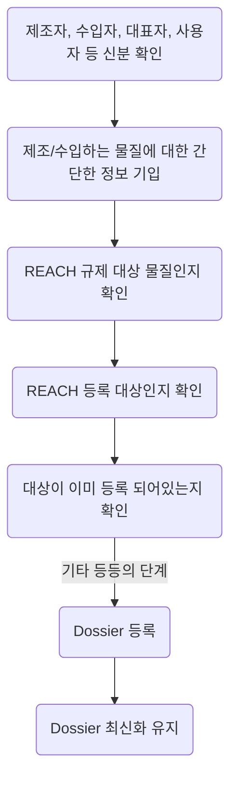

## Computational Toxicology란 무엇일까?

Computational Toxicology가 무엇인지 이해하기 위해서는 일단 Toxicology 자체를 생각해볼 필요가 있다. **Toxicology**의 정의는 무엇일까?
[NIH](https://www.niehs.nih.gov/)(National Institute of Environmental Health Sciences)에서는 Toxicology에 대한 정의를 다음과 같이 정의하고 있다.

> Toxicology는 사람이나 동물, 환경에 악영향을 미칠 수 있는 물질이나 상황, 화학물질에 대한 것을 탐구(이해)하는 학문이다.[^NIH] (필자 나름대로의 번역이므로 완벽하지 않은 번역임을 참고하자.)

이런 Toxicology에서 **탐구, 이해**라는 것은 굉장히 범위가 넓다. 단순히 특정 물질이 인간에게 미치는 영향을 확인하는 단계에서부터 **왜 그러한 표현형이 나타나는지** 혹은 **어떠한 원리로 나타나는지**, **어느 정도까지가 위험한 것인지** 등 탐구의 폭은 굉장히 넓다. 필자가 절대로 이 분야의 권위자라고 말할 수는 없는 상황이지만 Toxicology를 탐구하는 과정에서 **컴퓨터**를 사용한다면 이것은 Computational Toxicology라고 할 수 있겠다.

Computational Toxicology는 다시 세부 분야로 쪼개질 수 있다. 특정한 물질이 미치는 영향을 평가하기 위해서 우리는 **Risk assessment** 등의 과정을 수행할 수 있다. 이러한 결과들을 종합하고 결론을 도출하는데 컴퓨터를 사용할 수 있다. 이러한 부분도 어느 정도 Computational Toxicology라고 부를 수 있을 것이다.

그러나 필자가 이곳에서 작성하고 싶은 것은 **Cheminformatics**와 합쳐진 형태의 **Computational Toxicology**이다. 학문의 도구로서 **Cheminformatics**를 활용한다.

## Cheminformatics and Computational Toxicology

Cheminformatics는 분자를 이해하는 학문이다. 분자가 가지고 있는 물리-화학적 특성을 계산하고 이것을 예측하고 다양한 분야를 넘나든다. Cheminformatics가 녹아있는 분야들은 *Drug development*, 혹은 *Drug discovery* 등이 대표적이다. Drug, 약물로 대표되는 이 분야는 아직도 *Small molecule*, 저분자 화합물이 대세인 곳이다. 이런 곳에서는 Cheminformatics의 지식을 활용하여 새로운 약물을 개발하거나 이미 있는 약물을 개선하여 효능을 더욱 끌어내는 등의 일이 가능하다.

>Computational Toxicolgy는 어떨까? 어떻게 Cheminformatics를 활용하여 어떤 일을 하려고 하는 것일까?

### Quantitative Structure-Activity Relationships (QSARs)

Toxicologist들도 화학물질이 보이는 **독성**을 예측하려는 움직임이 있다. 그것이 대표적으로 **QSAR**라는 아이디어로 나타난다. QSAR는 **비슷한 분자 구조를 가지고 있다면 그 활성도 비슷하다** 라는 다소 과격한 아이디어를 통해 나타났다. 이는 여러 분자들의 구조를 파악하고 독성을 나타내는 특정한 패턴을 발견하는 것을 목표로 한다. 특히 이 패턴을 목록화 하여 *기존에는 보고가 없었던 신물질*에 대해서도 어느 정도 특성을 파악할 수 있기 때문에 상당히 도움이 되는 방식이다. 주로 예측 분야에서 자주 사용되고 있다.
그러나 QSAR에는 크나큰 한계가 많이 존재한다. 오히려 단백질 분자보다 더 까다로운 부분이 QSAR를 활용한 Small molecule의 특성 예측일 수도 있다. 이는 추후 게시글에서 본격적으로 다뤄볼 예정이다.

### Read-across

Read-across는 QSAR와 비슷한 접근법이다. 근간이 되는 아이디어는 같다. **유사한 분자 구조를 가지고 있다면 그 활성도 비슷하다** 라는 아이디어 자체는 그대로 가져가되, 기존에 있는 독성 분자들의 구조 패턴을 이용하여 새로운 물질들의 활성도 예측하겠다는 방식이 아니다.
유사한 구조를 가지고 있는 **이미 알려진** 물질들의 특성을 가져와서 이 특성을 나타낼 확률이 높을 것이라고 예측하는 기술이다. 이것 또한 QSAR와 유사한 한계점을 가지고 있다.

## 현 시점에서의 Computational Toxicology는 어디까지 왔을까?

Computational Toxicology를 이끌고 있는 집단은 크게 3가지로 나눌 수 있을 것 같다. [The European Chemicals Agency (ECHA)](https://echa.europa.eu/home)와 [The United States Environmental Protection Agency (US EPA)](https://www.epa.gov/), [The Organisation for Economic Co-operation and Development (OECD)](https://www.oecd.org/)가 대표적이다. ECHA와 EPA는 2010년 12월부터 파트너쉽을 운영[^ECHAEPA]하고 있으며 특히 OECD는 Computational toxicology의 진입장벽을 낮추는 역할을 톡톡히 수행하고 있다고 판단된다.

여기서 Computational toxicology를 적극적으로 도입하고 있는 것은 **체감 상** **ECHA와 OECD** 쪽이다. ECHA는 2007년부터 **Registration, Evaluation, Authorisation and Restriction of Chemicals (REACH)** 라고 부르는 제도를 발표하면서 특정 양식을 통해 화학물질을 등록-규제 하려고 했다. 유럽 내에서 화학물질을 유통하고 소비하기 위해서는 이 *REACH* 시스템에 화학 물질을 등록해야 하는데 여기에 필요한 문서들에는 **독성 자료, 환경 영향 평가 자료** 등이 포함되어있다.

물론 규정에 근거하여 유럽 경제 지역 내부에서 얼마나 유통 되는지에 따라 등록해야하는 의무가 달라질 순 있지만 말이다.

> REACH 등록 절차 (2021년 기준, version 4.0)

ECHA에서 배포하는 *Guidance on registration*[^REACHguide]을 확인하면 위와 같은 등록 절차가 있는 것을 볼 수 있다. 이 중에서 **Dossier 등록** 부분이 중요하다. 여기에 독성 자료들이 필요하다. 독성 자료는 다시 **hazard information**과 **Dose-response assessment**, **Exposure assessment**로 세분화할 수 있다. 이런 것들을 모아서 **Risk assessment**라고 하며 이 3가지에 **QSAR 혹은 Read-across**를 적극적으로 도입하려고 한다.

  실제 동물 실험이나 세포 실험을 진행하지 않는, 기존의 독성 자료들을 토대로 신물질에 대한 등록절차를 간소화 하는 창구로 활용하겠다는 의지가 아닐까 싶다. 물론 이 부분에 대해서는 의견이 좀 갈리는 것 같다.

- 동물 복지, 연구 윤리의 발전으로 동물 실험 금지와 함께 부상된 대체 시험법으로 보는 시각
- 무수히 많이 쏟아지고 있는 새로운 화학 물질 등록의 인적-물적 자원 낭비를 막기 위한 기술로 보는 시각

이렇게 2가지가 대표적으로 존재하는 듯 하다.

### 그래서 얼마나 도입되었을까?

REACH 데이터 베이스에 등록하기 전에 먼저 [IUCLID Database]([Home - IUCLID (europa.eu)](https://iuclid6.echa.europa.eu/))에 화학 물질을 등록해야 한다. 이후 ECHA가 심사하는 단계를 거치게 될텐데, 여기에 등록된 물질 중에서 Read-across 혹은 QSAR를 사용하여 독성 자료를 제시한 물질들의 분포도는 아래와 같다.

{: .shadow .rounded-10}
_2019년 기준 IUCLID에 등록될 때 각 세션에 대해서 어떤 방식으로 자료를 제시했는지 나타나는 통계_

생각보다 많은 부분에서 **Read-across**가 차지하고 있는 것을 볼 수 있다[^IUCLID]. 기술이 점점 발전하면서 Read-across 의 방식도 정교하게 되어가는 중임을 고려해보면 아마 2024년 기준으로는 더 많은 자료들이 QSAR 혹은 Read-across로 제시되고 있지 않을까 유추해 볼 수 있다.

### OECD의 진입 장벽 낮추기

ECHA나 EPA는 적극적으로 규제 정보를 수집하는 과정에 Read-across 혹은 QSAR와 같은 computational toxicology를 도입하고 있다. 그리고 **OECD**에서는 많은 사람들이 쉽게 접근할 수 있도록 이 Read-across, QSAR를 써볼 수 있는 **프로그램**을 개발했다.
그것이 바로 [QSAR Toolbox](https://qsartoolbox.org/) 프로그램이다. OECD 기구와 ECHA, [LMC Oasis](https://oasis-lmc.org/) 이렇게 3곳이 주도적으로 이끌고 있다. OECD는 이미 2005년 부터 이러한 프로그램을 개발하려는 움직임이 있었고 현재는 상당히 많은 곳에서 차용하고 있는 프로그램이 아닐까 싶다. 그러나 이곳에도 여전한 한계점이 있기 마련이다. 이런 것들은 추후 게시글에서 작성해보도록 하겠다.

## 끝맺음

끝맺음이 조금 뜬금 없지만 오늘은 이렇게 Computational Toxicology에 대해서 간략하게 정리해 보았다. 항상 이러한 글들은 동료 평가도 없고 개인적인 블로그에서 개인이 쓴 것이기 때문에 곧이곧대로 믿어선 안 된다. 최대한 정확한 정보를 전달하려고 쓴 글도 아니라서.. 사실 흥미 유발 요소로 넣어놨다. 미래의 꿈나무들이 궁금해 할 수도 있으니까...
세상에는 다양한 분야들이 있고 다양한 도전과 다양한 한계, 다양한 직업들이 있다. 그 수많은 길 중에 하나를 소개할 뿐이다.

---

[^NIH]: [https://www.niehs.nih.gov/health/topics/science/toxicology](https://www.niehs.nih.gov/health/topics/science/toxicology)
[^ECHAEPA]: [https://echa.europa.eu/-/echa-and-the-us-epa-start-working-together](https://echa.europa.eu/-/echa-and-the-us-epa-start-working-together)
[^REACHguide]: [링크](https://echa.europa.eu/documents/10162/2324906/registration_en.pdf/de54853d-e19e-4528-9b34-8680944372f2) ECHA에서는 가이드들을 최신화 하면서 링크가 사라지는 경우가 있기 때문에 관련 자료를 발견할 수 있는 [페이지](https://echa.europa.eu/regulations/reach/registration)도 남긴다.
[^IUCLID]: [The use of alternatives to testing on animals for the REACH Regulation, Fourth report under Aritcle 117(3) of the REACH Regulation, 2020](https://echa.europa.eu/documents/10162/0/alternatives_test_animals_2020_en.pdf) 

